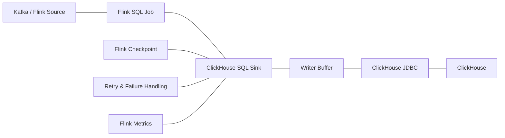
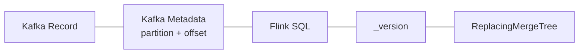
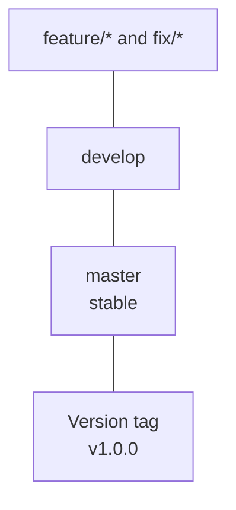

# Flink SQL Connector for ClickHouse

A maintained fork of [itinycheng/flink-connector-clickhouse](https://github.com/itinycheng/flink-connector-clickhouse), focused on improving the stability and reliability of the **Flink SQL sink for ClickHouse**.

This project is built on top of the original connector and keeps its history and attribution. The current development direction focuses primarily on the sink path, including failure handling, retries, checkpoint recovery, memory bounds, metrics, and CDC workloads.

## Project Scope

The actively maintained scope of this fork is the **Flink SQL sink**.

Source, lookup, and catalog implementations inherited from the upstream project remain available for compatibility, but they are not the main focus of this fork.

Current work focuses on:

* checkpoint-aware flushing
* asynchronous failure propagation
* bounded JDBC retries
* configurable connection and socket timeouts
* bounded record and memory buffering
* sink metrics
* append workloads
* ClickHouse mutation-based updates and deletes
* versioned CDC with `ReplacingMergeTree`
* Flink checkpoint recovery
* compatibility testing with recent Flink and ClickHouse versions

The connector currently provides **at-least-once delivery**.

Exactly-once delivery is not claimed.

More details about completed and remaining work are available in [docs/production-readiness.md](docs/production-readiness.md).

## Why This Fork?

The original [itinycheng/flink-connector-clickhouse](https://github.com/itinycheng/flink-connector-clickhouse) project provides the foundation of this connector.

This fork keeps that foundation while concentrating development on the Flink SQL sink.

The main changes include:

* Flink Sink V2 checkpoint integration
* scheduled flush failure propagation through the Flink mailbox
* retryable and non-retryable JDBC error classification
* bounded retry with jittered backoff
* connection and socket timeout configuration
* buffering limits by records and estimated bytes
* sink metrics
* checkpoint recovery testing
* ambiguous JDBC failure testing
* append-only CDC support using `ReplacingMergeTree`
* newer Flink and ClickHouse JDBC compatibility
* containerized integration tests

The goal is not to replace the upstream project, but to maintain a specialized fork with a stronger focus on sink stability.

## Connector Architecture



The sink buffers incoming records and writes them to ClickHouse in JDBC batches.

Checkpointing, retry handling, and scheduled flush failures are handled as part of the sink lifecycle.

## Delivery Semantics

The sink provides **at-least-once delivery**.

A Flink checkpoint flushes pending JDBC batches before the checkpoint completes.

However, ClickHouse and the Flink checkpoint do not participate in the same distributed transaction.

ClickHouse may successfully accept a batch while the client loses the acknowledgement or the Flink checkpoint later fails.

After recovery, Flink may replay those records.

This means duplicate physical rows are possible.

Applications that require logical deduplication should design the ClickHouse table accordingly.

## Append Workloads

For append workloads, retry deduplication is primarily a ClickHouse table design concern.

Replicated MergeTree-family tables can deduplicate identical recent insert blocks.

For non-replicated MergeTree tables, `non_replicated_deduplication_window` can be configured.

This mechanism is bounded and depends on ClickHouse receiving an equivalent block during retry.

Different batch boundaries, row ordering, parallel writers, or an expired deduplication window may still result in duplicates.

### insert_deduplication_token

Do not configure a static:

```text
properties.insert_deduplication_token
```

A static token would be reused across independent batches and could cause valid rows to be discarded.

The connector currently rejects this configuration.

### Async inserts

When using:

```text
properties.async_insert = 1
```

`wait_for_async_insert` must remain enabled.

This ensures that a successful acknowledgement means ClickHouse has completed the buffered insert rather than only accepting it into an asynchronous queue.

## Versioned CDC with ReplacingMergeTree

For CDC workloads, the connector supports an append-based strategy designed for ClickHouse `ReplacingMergeTree`.

Example ClickHouse table:

```sql
CREATE TABLE customer_cdc
(
    id UInt64,
    name String,
    _version UInt64,
    _is_deleted UInt8
)
ENGINE = ReplacingMergeTree(_version, _is_deleted)
ORDER BY id;
```

The Flink sink can use:

```sql
'sink.update-strategy' = 'insert'
```

This strategy requires physical `_version` and `_is_deleted` columns in ClickHouse.

`_version` represents the ordering of changes for the same logical record.

The connector does not generate this value automatically. The Flink pipeline is responsible for providing and mapping it.

### Using Kafka offset as `_version`

In a Kafka-based CDC pipeline, `_version` can be derived directly from Kafka metadata.

Flink's Kafka source can expose the Kafka record offset as a virtual metadata column:

```sql
CREATE TABLE kafka_source (
    id BIGINT,
    name STRING,

    kafka_partition INT METADATA FROM 'partition' VIRTUAL,
    kafka_offset BIGINT METADATA FROM 'offset' VIRTUAL
) WITH (
    'connector' = 'kafka',
    ...
);
```

The Flink job can then map `kafka_offset` into the ClickHouse `_version` column:

```sql
INSERT INTO clickhouse_sink
SELECT
    id,
    name,
    kafka_offset AS _version,
    CAST(0 AS TINYINT) AS _is_deleted
FROM kafka_source;
```

The mapping belongs to the Flink job rather than the ClickHouse connector, which means the versioning strategy can be customized for each pipeline.



Kafka offsets are monotonically increasing **within a Kafka partition**, not across the entire topic.

Therefore, using the Kafka offset directly as `_version` works best when all changes for the same logical primary key are guaranteed to stay in the same Kafka partition, which is normally achieved by partitioning Kafka records by that key.

For example:

```text
customer_id = 1001
```

should consistently be routed to the same Kafka partition.

Its change sequence can then look like:

```text
offset 120  INSERT
offset 145  UPDATE
offset 182  UPDATE
offset 240  DELETE
```

For that logical key, the offset provides a natural ordering value that can be used as `_version`.

If the same logical key can move between Kafka partitions, Kafka offset alone is not a globally comparable ordering value. In that case, another source ordering field such as a database LSN, transaction sequence, timestamp-plus-sequence value, or another monotonic CDC version should be used instead.

## CDC Changelog Mapping

For `sink.update-strategy = 'insert'`, the connector treats changelog records as follows:

| Flink RowKind   | Sink behavior                                                               |
| --------------- | --------------------------------------------------------------------------- |
| `INSERT`        | Insert with `_is_deleted = 0`                                               |
| `UPDATE_AFTER`  | Insert a new version with `_is_deleted = 0`                                 |
| `UPDATE_BEFORE` | Ignore                                                                      |
| `DELETE`        | Insert a new version with `_is_deleted = 1` when delete handling is enabled |

This strategy does not execute ClickHouse `ALTER UPDATE` or `ALTER DELETE` mutations.

The Flink primary key and the ClickHouse `ORDER BY` key should represent the same logical record identity.

## ReplacingMergeTree Behavior

`ReplacingMergeTree` does not immediately remove older versions of a row.

Replacement happens during ClickHouse background merges.

Multiple physical versions may therefore exist at the same time.

Queries requiring a reconciled current-state view can use an appropriate ClickHouse query strategy such as `FINAL`, while considering its additional read cost.

ClickHouse `PRIMARY KEY` does not enforce uniqueness. It is primarily used as a sparse index for data skipping.

## Failure Handling

Scheduled flushes run asynchronously.

If a flush encounters a permanent JDBC error, or all configured retries are exhausted, the connector propagates the failure to the Flink task.

The sink does not continue indefinitely with a permanently failed batch.

Recovery is controlled by Flink and the deployment environment.

A typical recovery process is:

1. Inspect the Flink task failure.
2. Fix the ClickHouse table, connection, or underlying failure.
3. Restart or resume the Flink job.
4. Restore from the latest completed checkpoint.
5. Allow the source to replay records not covered by that checkpoint.

Because delivery is at-least-once, records accepted by ClickHouse before an ambiguous failure may be written again after recovery.

## Compatibility

The currently verified environment is:

| Component       | Verified version |
| --------------- | ---------------- |
| Apache Flink    | 2.1.0, 2.2.1     |
| Java            | 17               |
| ClickHouse      | 24.8, 26.3       |
| clickhouse-jdbc | 0.9.8            |

Other versions may work, but are not currently covered by the same test suite.

## Installation

The connector is currently built from source and is not published to Maven Central.

Clone this repository:

```bash
git clone https://github.com/VQHieu1012/flink-connector-clickhouse.git

cd flink-connector-clickhouse
```

Build the project:

```bash
mvn clean install
```

For a local build without tests:

```bash
mvn clean install -DskipTests
```

The deployable SQL connector module is:

```text
flink-sql-connector-clickhouse
```

## Flink SQL Example

```sql
CREATE TABLE t_user (
    user_id BIGINT,
    user_type INT,
    language STRING,
    country STRING,
    score DOUBLE,
    PRIMARY KEY (user_id) NOT ENFORCED
) WITH (
    'connector' = 'clickhouse',
    'url' = 'jdbc:ch://127.0.0.1:8123',
    'database-name' = 'tutorial',
    'table-name' = 'users',
    'sink.batch-size' = '1000',
    'sink.max-buffered-bytes' = '64mb',
    'sink.flush-interval' = '1s',
    'sink.max-retries' = '3'
);
```

Write data:

```sql
INSERT INTO t_user
SELECT
    user_id,
    user_type,
    language,
    country,
    score
FROM source_table;
```

## Sink Options

| Option                    | Required | Default    | Description                                    |
| ------------------------- | -------- | ---------- | ---------------------------------------------- |
| `url`                     | yes      | none       | ClickHouse JDBC URL                            |
| `database-name`           | no       | `default`  | ClickHouse database                            |
| `table-name`              | yes      | none       | ClickHouse target table                        |
| `username`                | no       | none       | ClickHouse username                            |
| `password`                | no       | none       | ClickHouse password                            |
| `use-local`               | no       | `false`    | Write to local tables when appropriate         |
| `sink.batch-size`         | no       | `1000`     | Maximum buffered records before flushing       |
| `sink.max-buffered-bytes` | no       | `64mb`     | Estimated maximum buffered row size per writer |
| `sink.flush-interval`     | no       | `1s`       | Scheduled flush interval                       |
| `sink.max-retries`        | no       | `3`        | Additional retries for retryable JDBC failures |
| `sink.connection-timeout` | no       | `10s`      | JDBC connection timeout                        |
| `sink.socket-timeout`     | no       | `5min`     | JDBC socket timeout                            |
| `sink.update-strategy`    | no       | `update`   | Update handling strategy                       |
| `sink.ignore-delete`      | no       | `true`     | Ignore or process delete events                |
| `sink.parallelism`        | no       | inherited  | Explicit sink parallelism                      |
| `sink.partition-strategy` | no       | `balanced` | `balanced`, `hash`, or `shuffle`               |
| `sink.partition-key`      | no       | none       | Partition key for hash partitioning            |
| `properties.*`            | no       | none       | Additional ClickHouse JDBC or server settings  |

## Update Strategies

### update

`UPDATE_AFTER` records are handled using ClickHouse mutation operations.

ClickHouse mutations are more expensive than normal inserts and are asynchronous by default.

If the application requires waiting for mutation completion, configure an appropriate `properties.mutations_sync` value.

### insert

Uses the append-based CDC strategy with `ReplacingMergeTree`.

Requires:

```text
_version
_is_deleted
```

### discard

Update records are discarded according to the configured changelog behavior.

## Memory Bounds

Each sink writer limits buffered data using both:

```text
sink.batch-size
```

and:

```text
sink.max-buffered-bytes
```

A flush occurs when either threshold is reached.

The byte limit is based on estimated serialized row size.

A single record larger than the configured limit is still accepted as one batch.

Total buffering also depends on sink parallelism because each writer maintains its own buffer.

## Metrics

The sink exposes standard Flink metrics including:

```text
numRecordsSend
numRecordsSendErrors
numBytesSend
currentSendTime
```

The `clickhouse` metric group also exposes:

```text
batchesSent
batchesSendErrors
retries
bufferedRecords
bufferedBytes
```

## Development Model

The repository can use separate branches for stable code and active development.



`master` contains the latest stable code.

`develop` contains ongoing development.

Feature and bug-fix branches are merged into `develop` first.

When a tested development state is considered stable, it can be merged into `master` and marked with a version tag.

Users should prefer a version tag for reproducible deployments.

Example tags:

```text
v1.0.0
v1.0.1
v1.1.0
```

## Data Type Mapping

| Flink Type            | ClickHouse Type                                               |
| --------------------- | ------------------------------------------------------------- |
| `CHAR`                | `String`                                                      |
| `VARCHAR`             | `String`, `IP`, `UUID`                                        |
| `STRING`              | `String`, `Enum`                                              |
| `BOOLEAN`             | `UInt8`                                                       |
| `BYTES`               | `FixedString`                                                 |
| `DECIMAL`             | `Decimal`, `Int128`, `Int256`, `UInt64`, `UInt128`, `UInt256` |
| `TINYINT`             | `Int8`                                                        |
| `SMALLINT`            | `Int16`, `UInt8`                                              |
| `INTEGER`             | `Int32`, `UInt16`, `Interval`                                 |
| `BIGINT`              | `Int64`, `UInt32`                                             |
| `FLOAT`               | `Float32`                                                     |
| `DOUBLE`              | `Float64`                                                     |
| `DATE`                | `Date`                                                        |
| `TIME`                | `DateTime`                                                    |
| `TIMESTAMP`           | `DateTime`                                                    |
| `TIMESTAMP_LTZ`       | `DateTime`                                                    |
| `INTERVAL_YEAR_MONTH` | `Int32`                                                       |
| `INTERVAL_DAY_TIME`   | `Int64`                                                       |
| `ARRAY`               | `Array`                                                       |
| `MAP`                 | `Map`                                                         |
| `ROW`                 | Not supported                                                 |
| `MULTISET`            | Not supported                                                 |
| `RAW`                 | Not supported                                                 |

## Upstream and Attribution

This repository is based on:

[itinycheng/flink-connector-clickhouse](https://github.com/itinycheng/flink-connector-clickhouse)

The original connector design and implementation come from the upstream project and its contributors.

This fork preserves that history while maintaining a separate development direction focused mainly on Flink SQL sink stability.

Contributions inherited from upstream remain subject to their original copyright and license notices.

## License

This project is licensed under the Apache License 2.0.

See [LICENSE](LICENSE) and [NOTICE](NOTICE) for details.
